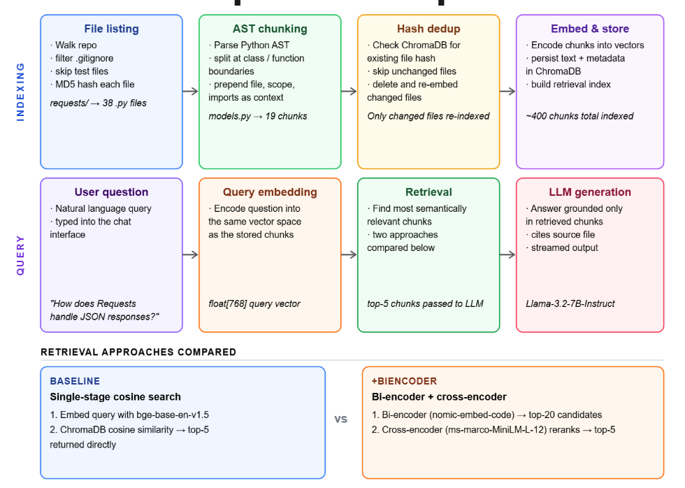

# RepoHero

A retrieval-augmented generation (RAG) system that answers natural language questions about Python codebases. Point it at any Python repository and ask questions like *"What happens when a client sends JSON data to a FastAPI endpoint?"* and it retrieves the relevant source code and generates a grounded answer.

**Final accuracy: 80% across 130 questions on three real-world libraries (FastAPI, Pydantic, Requests).**

📺 [Watch the 5-minute project walkthrough](#) · [Watch the frontend demo](#)

[](https://youtu.be/cM4_ZCd2KdE)

---

## What It Does

RepoHero ingests a Python repository, chunks it into semantically meaningful units, indexes those chunks, and answers questions in natural language, citing the source files it drew from.

The system is designed around a core insight: getting good answers from a codebase isn't just a generation problem, it's a retrieval precision problem. A general-purpose embedding model can pull in chunks that *look* relevant but miss the actual logic. RepoHero addresses this with a two-stage retrieval pipeline.

---

## Architecture



### Key Components

**AST-based Chunking**: instead of splitting code at fixed character intervals, the chunker uses Python's abstract syntax tree to preserve complete functions, classes, and methods as atomic units. Each chunk is enriched with metadata (function name, class name, file path, hierarchical context). 

**Two-Stage Retrieval**
- *Stage 1: Bi-encoder:* [`nomic-ai/nomic-embed-code`](https://huggingface.co/nomic-ai/nomic-embed-code), a dense retrieval model pre-trained on code corpora, encodes the query and all stored chunks into a shared vector space. The top-20 candidates are retrieved by cosine similarity. Embeddings are stored as normalized `float32` arrays; retrieval uses `numpy.argpartition` rather than a full sort, keeping query time fast even over thousands of chunks.

- *Stage 2: Cross-encoder:* [`cross-encoder/ms-marco-MiniLM-L-12-v2`](https://huggingface.co/cross-encoder/ms-marco-MiniLM-L-12-v2) re-ranks the 20 candidates by scoring each query–chunk pair jointly. Unlike the bi-encoder, the cross-encoder attends across both inputs simultaneously, catching relevance signals the first stage misses. The top-5 chunks are passed to the LLM.

**ChromaDB**: used for persistent storage of chunk text and metadata. Fingerprint hashing prevents redundant indexing when a repository is re-indexed.

**Evaluation (RAGAS)**: a custom evaluation pipeline using Llama 3.1 8B as a judge LLM. Each generated answer is compared against a ground-truth answer; the judge returns PASS/FAIL with reasoning. Built from scratch rather than the official RAGAS library due to compatibility issues with local Ollama models. Evaluated over 130 questions across three repositories.

**Web Interface**: React + Vite frontend, Flask backend. Users enter a repository path, click "Index Repository," and ask questions in a chat interface.

---

## Results

| Repository | Questions | Baseline (BGE) | Two-Stage | Gain |
|---|---|---|---|---|
| FastAPI | 40 | 75.0% | 85.0% | +10.0% |
| Pydantic | 40 | 65.0% | 77.5% | +12.5% |
| Requests | 50 | 80.0% | 76.0% | −4.0% |
| **Total** | **130** | **73.8%** | **80.0%** | **+6.2%** |

The baseline uses `BGE-base-en-v1.5` served through Ollama, retrieving the top-5 chunks directly from ChromaDB. The two-stage system improves meaningfully on Pydantic (+12.5%), the most complex and internally similar codebase, where precision in retrieval matters most. The slight dip on Requests is attributable to many handler functions with similar structure, making it hard for either stage to confidently distinguish candidates.

---

## Stack

| Layer | Technology |
|---|---|
| Chunking | Python AST, custom pipeline |
| Embeddings | `nomic-ai/nomic-embed-code`, `sentence-transformers` |
| Re-ranking | `cross-encoder/ms-marco-MiniLM-L-12-v2` |
| Vector store | ChromaDB |
| LLM (generation) | Llama 3.2 1B via Ollama |
| LLM (judge) | Llama 3.1 8B via Ollama |
| Backend | Flask |
| Frontend | React + Vite |

---

## Setup

**Requirements:** Python 3.10+, Node.js, [Ollama](https://ollama.com/) running locally.

```bash
# Python dependencies
pip install -r requirements.txt

# Frontend dependencies
cd web/frontend && npm install

# Pull required Ollama models
ollama pull hf.co/CompendiumLabs/bge-base-en-v1.5-gguf
ollama pull hf.co/bartowski/Llama-3.2-1B-Instruct-GGUF
ollama pull llama3.1:8b
```

## Usage

**CLI (baseline retriever)**
```bash
python main.py
# Enter the path to any local Python repository when prompted
```

**CLI (two-stage retriever)**
```bash
python main.py --biencoder
```

**Web app**
```bash
# Terminal 1: backend
python web/backend/app.py

# Terminal 2: frontend
cd web/frontend && npm run dev
# Opens at http://localhost:5173
```

**Evaluation**
```bash
python test.py              # baseline
python test.py --biencoder  # two-stage
# Results written to output/results.csv
```

---

## Project Structure

```
RepoHero/
├── main.py          # CLI entrypoint
├── retriever.py     # Two-stage bi-encoder + cross-encoder pipeline
├── test.py          # RAGAS-style evaluation script
├── chunker/         # AST-based chunking module
├── web/
│   ├── backend/     # Flask API
│   └── frontend/    # React + Vite app
└── data/            # Evaluation CSV files (question, expected_answer)
```

---

## Team

Built by Maaheen Yasin, Andy Tong, and Hanyi Zhang for CMPT 713 (Natural Language Processing) at Simon Fraser University.
