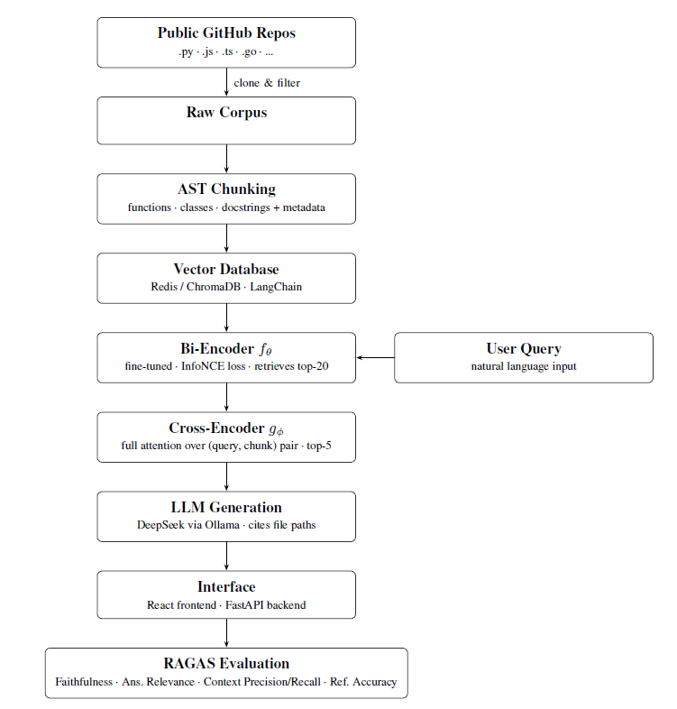

# RepoHero: A Retrieval-Augmented Generation (RAG) system for interactive understanding of GitHub repositories

## Overview

Understanding large and complex codebases can be challenging, especially for new developers joining a project. **RepoHero** enables natural language exploration of code by combining **AST-inspired chunking**, **embedding-based retrieval**, and **LLM-powered answers**, helping developers quickly find relevant code snippets with context-aware explanations.

## Key Features

- **Code Ingestion:** Load source files from a local repository for analysis.
- **Chunking:** Splits code into meaningful chunks (currently line-based, AST-ready for future updates).
- **Embedding & Vector DB:** Converts code chunks into embeddings using a pre-trained model for semantic search.
- **Retrieval:** Finds top-k relevant code chunks based on cosine similarity.
- **Interactive Chat:** Uses an LLM to answer natural language questions about the code, grounded in retrieved chunks.

## Overall Pipeline 



*Figure 1: End-to-end RAG pipeline showing ingestion → chunking → embedding → retrieval → interactive chat.*

## Run RAG pipeline on a sample file

```bash
python main.py
```

## Example Interaction

```text
Ask me a question: What does the main function do?

Retrieved Chunks:
Chunk: def main(): ...
Score: 0.92

Chatbot response:
This function initializes the RepoHero pipeline, ingests code, generates embeddings, and launches the interactive chat interface.
```